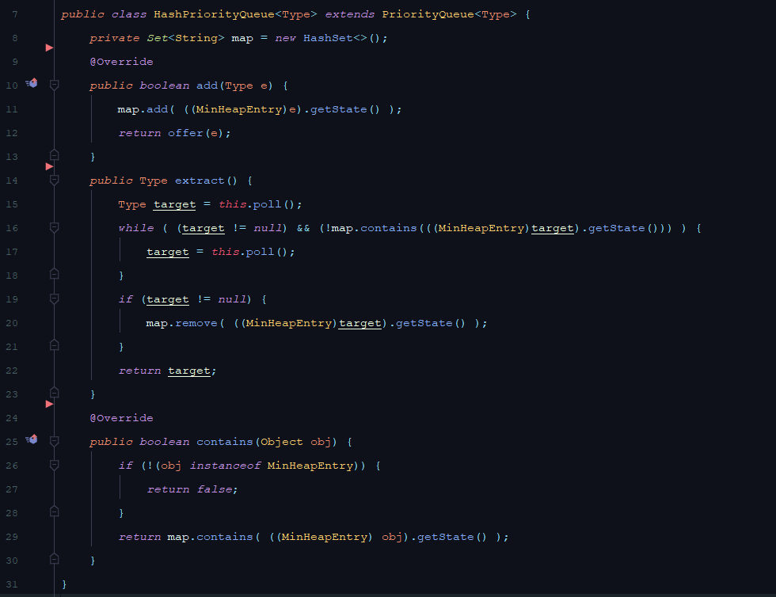
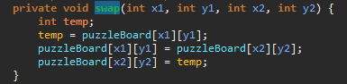
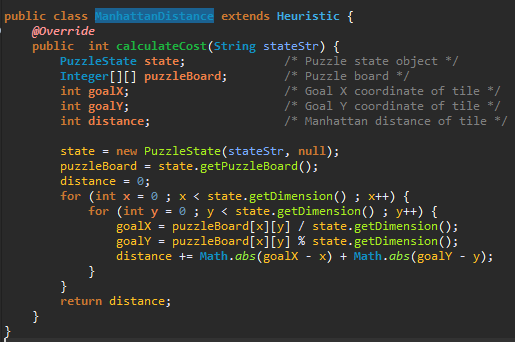
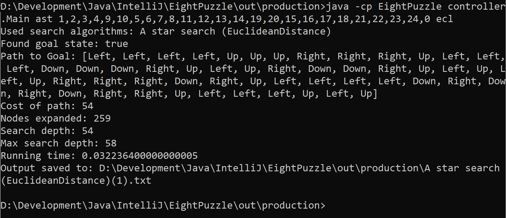
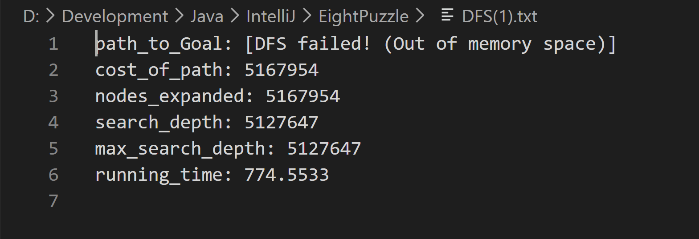

 

**Faculty of Engineering, Alexandria University**

**CC482 - Artificial Intelligence**

# Eight Puzzle solver

Assignment I for the Artificial Intelligence course at [Faculty of Engineering, Alexandria University](https://eng.alexu.edu.eg/index.php/en/). Based on the "ColumbiaX: CSMM.101x Artificial Intelligence" original [here](https://courses.edx.org/courses/course-v1:ColumbiaX+CSMM.101x+1T2020/courseware/ea3118a1b62849b99423f8b1182e1bbf/a1f977f8f5ab4e79a123133a94d77c7e/?activate_block_id=block-v1%3AColumbiaX%2BCSMM.101x%2B1T2020%2Btype%40sequential%2Bblock%40a1f977f8f5ab4e79a123133a94d77c7e).

 
 

 

 

## Content:

1. Introduction

2. Algorithms

    1. Breadth-first search

    2. Depth-first search

    3. A* search

3. Data structures

    4. HashQueue

    5. HashStack

    6. HashPriorityQueue

4. Program operation flow

5. Sample runs

6. **"Bonus"**, solving any square puzzle (15 puzzle, 24 puzzle, etc..)

## 1. Introduction:

An instance of the 8-puzzle game consists of a board holding 8 distinct movable tiles, plus an empty space. For any such board, the empty space may be legally swapped with any tile horizontally or vertically adjacent to it. In this assignment, the blank space is going to be represented with the number 0.

Given an initial state of the board, the search problem is to find a sequence of moves that transitions this state to the goal state; that is, the configuration with all tiles arranged in ascending order 0,1,2,3,4,5,6,7,8 .

The search space is the set of all possible states reachable from the initial state. The blank space may be swapped with a component in one of the four directions ‘Up’, ‘Down’, ‘Left’, ‘Right’, one move at a time. The cost of moving from one configuration of the board to another is the same and equal to one. Thus, the total cost of path is equal to the number of moves made from the initial state to the goal state.

## 2. Algorithms:

### a. Breadth-first search (BFS):

As its name implies, BFS performs the search by traversing the graph level by level. The algorithm works as follows:

 

 

### b. Depth-first search (DFS):

As its name implies, DFS performs the search by traversing the graph branch by branch, that is, it chooses a child of the root’s and goes as deep as possible before moving to the next child. The algorithm works as follows:

 

 

### c. A* search:

A* search uses a cost function called a "heuristic" to decide the next move. Thus, it chooses the least costly move among all possible moves on each iteration. The used heuristics in this assignment are:

#### Manhattan Distance:

#### Euclidean Distance:

#### The algorithm works as follows:

 

 

## 3. Data structures:

Most of the overhead in the search algorithms lies in the **contains()** function (i.e. *Stack.contains()* , *Queue.contains()* , *Heap.contains()*). For stack and queue, the time complexity for *contains()* is *O(N)* as it performs linear search to check whether a given entry exists in the data structure or not. As for the heap (or PriorityQueue in Java), the time complexity is *O(lg(N))*. Thus, an alternative had to be found.

To overcome the problem, I implemented 3 classes (HashQueue, HashStack, HashPriorityQueue) that minimize the time complexity to **_O(1)_**.

### a. HashQueue:

HashQueue is a class that extends *java.util.ArrayList* to inherit its attributes and methods. Moreover, HashQueue has an extra attribute; a **HashSet** called **map.** The main difference is the method **contains()** which is **overridden** so that it uses **map.contains()** instead of performing a linear search on the queue (or ArrayList) itself. This decreases the time complexity dramatically to **_O(1)_**.

### b. HashStack:

Like HashQueue, HashStack solves the same problem of the *O(N)* **contains()** function. Luckily the same solution of the **HashSet** called **map** applies here as well; HashStack extends *java.util.Stack* then **overrides** **Stack.contains()** to use **map.contains()**. Moreover, HashQueue overrides both **Stack.push()** and **Stack.pop()** to update the **HashSet** properly.

### c. HashPriorityQueue:

HashPriorityQueue has shared concepts with the previous data structures; it uses an internal **HashSet** attribute called **map** to cut down the complexity of **contains()**, but this time from *O(lg(N))* to *O(1)*. Of course, it overrides **PriorityQueue.add()** as well. Moreover, in **extract(),** HashPriorityQueue handles key updating in the heap efficiently; instead of performing an *O(N)* linear search to remove the entry with the old key then reinsert it with the new keyin *O(lg(N))*, it inserts the new entry as a duplicate with a different key but maintains only one entry for both entries in the HashSet. So that, whenever one of them is extracted from the heap (always the one with more prior key), the other gets discarded when it is extracted later from the head of the heap.

## 4. Program operation flow:

The program runs as an instance of the class **_GameDriver_**. This instance:

1. validates the input arguments and prints the proper format of arguments if the input was found to be faulty.

2. executes the chosen search algorithm by the user and prints the results.

3. saves the results as a text file in the current working directory and prints the path to that file in the command window for the user.

Below are the main functionalities of the program.

### Input Validator:

* Validates the arguments given by the user.

* Prints info to the user if the arguments are invalid.

### Game Driver:

GamDriver has 4 instances:

1. **initial**: which is an instance of *PuzzleState* representing the initial state given by the user.

2. **goal**: which is an instance of *PuzzleState* representing the goal state required.

3. **result**: which is an instance of *SearchResult* to hold the results found by the used search algorithm.

4. **outputGenerator**: which is an instance of *OutputGenerator* to save the results in a text file.

After validating the input, it creates instances of the *PuzzleState*, *SearchResult* and *OutputGenerator* classes and determines which search algorithm to use depending on what the user input was. Finally, it outputs the required output.

### Output Generator:

Exports the output of the Path to Goal, Cost of Path, Nodes Expanded, Search depth and Running Time to a file. Moreover, it returns the file path to the GameDriver to be printed in the command window for the user.

### PuzzleState:

PuzzleState is where the magic happens. It is responsible for maintaining the current puzzle state (as a string and a 2D array of integers), goal state, neighbor states and parent (previous) state.

It initializes the board dimensions and lays the initial state on the puzzleBoard.

### getGoalState:

Generate the string that represents the goal state.

### findNeighbors:

Generate possible neighbors.

### swap: 

Swaps the tiles of the puzzleBoard.

### EuclideanDistance:

Calculates the cost for A* search using the Euclidean math formula.

### ManhattanDistance:

Calculates the cost for A* search using the Manhattan formula.

## 5. Sample Runs:

### Breadth-first search (BFS):

### Depth-first search (DFS):

### A star search (Manhattan Distance):

### A star search (Euclidean Distance):

## 6. Bonus: Square puzzle solver:

In addition to solving the 8-puzzle, the program can solve all square puzzle boards that have a perfect square number of tiles (i.e. 8-puzzle, 15-puzzle, 24-puzzle, etc..). This was achieved by dynamically creating the initial puzzle state based on the provided input to match any square puzzle size.

### Bonus Sample Runs (15-Puzzle):

#### Breadth-first search (BFS):

#### Depth-first search (DFS):

#### A star search (Manhattan Distance):

#### A star search (Euclidean Distance):

### Bonus Sample Runs (24-Puzzle):

#### Breadth-first search (BFS):

#### Depth-first search (DFS):

#### A star search (Manhattan Distance):

#### A star search (Euclidean Distance):

### Bonus edge cases:

According to the policy of each search algorithm, the search may reach the goal or run out of space before reaching the goal. However, **this issue does not arise in 8-puzzle**. It only arises in bigger square puzzles (15-puzzle and bigger) due to the exponential growth of the search space. Thus, at a certain number of expanded nodes, roughly 3.8 million for BFS and 5.1 million for DFS (as it appears from multiple test cases), the program terminates and indicates that it ran out of memory space as shown below.

#### Breadth-first search (BFS):

#### Depth-first search (DFS):

For the initial state 1,2,3,7,0,4,5,6,8,9,10,11,12,13,14,15

